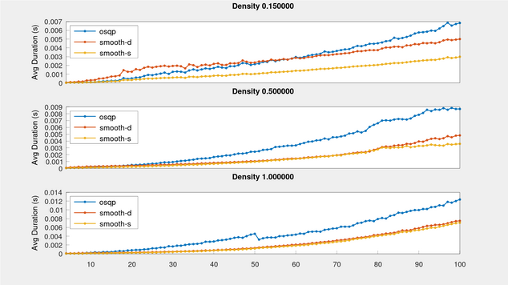

# smooth_feedback: Control and estimation on Lie groups

[![CI Build and Test][ci-shield]][ci-link]
[![Code coverage][cov-shield]][cov-link]
[![License][license-shield]][license-link]

Tool collection for control and estimation on Lie groups leveraging the
[smooth][smooth-link] library.


## Control on Lie groups

These controllers are implemented for systems with dynamics on the form
,&space;\quad&space;\mathbf{x}&space;\in&space;\mathbb{X},&space;\mathbf{u}&space;\in&space;\mathbb{U}) where `X` is a `smooth::LieGroup` and `U` is a `smooth::Manifold`. 

Nonlinearities are handled via linearization around a reference point or trajectory. For group-linear dynamics
this automatically results in a linear system in the tangent space, in which case these algorithms are expected
to work very well.

### Proportional-Derivative Control: A classic, now on Lie groups

* Model-free
* Assumes that inputs control body acceleration. See `examples/pid_se2.cpp` for an example of allocating PID inputs to actuators.

**Example** PID controller on SE(2)

```cpp
#include <smooth/feedpack/pid.hpp>

smooth::feedback::PID<std::chrono::duration<double>, smooth::SE2d> pid;

smooth::SE2d x;     // current state
Eigen::Vector3d v;  // current body velocity

Eigen::Vector3d u = pid(1s, x, v);
```

### Lie group Model-Predictive Control: When more look-ahead is needed

* Templated on the dynamical model
* Automatic linearization and time discretization of nonlinear dynamics
* Define state and input reference trajectories via arbitrary functions `T -> X` and `T -> U` for a time type T

**Example**: MPC on SE(2) x R3 (see `examples/mpc_se2.cpp`)

```cpp
#include <smooth/bundle.hpp>
#include <smooth/se2.hpp>
#include <smooth/feedback/mpc.hpp>

template<typename T>
using X = smooth::Bundle<smooth::SE2<T>, Eigen::Matrix<T, 3, 1>>;
template<typename T>
using U    = Eigen::Matrix<T, 2, 1>;
using Time = std::chrono::duration<double>;

// dynamics
auto f = []<typename T>(Time, const X<T> & x, const U<T> & u) -> typename X<T>::Tangent {
  typename X<T>::Tangent dx_dt;
  dx_dt.template head<3>() = x.template part<1>();
  dx_dt.template tail<3>() << -T(0.2) * x.template part<1>().x() + u(0), T(0),
    -T(0.4) * x.template part<1>().z() + u(1);
  return dx_dt;
};

// create MPC object
smooth::feedback::MPCParams prm{.T = 5};
smooth::feedback::MPC<50, Time, X<double>, U<double>, decltype(f)> mpc(f, prm);

// set desired state and input trajectories for MPC to track
mpc.set_xudes(
  [](Time t) -> X<double> { return X<double>::Identity(); },
  [](Time T) -> U<double> { return U<double>::Zero(); }
);

// calculate control input for current time t and current state x
Time t(0);
X<double> x = X<double>::Identity();
U<double> u;
auto qp_status = mpc(u, t, x);
```

### Active Set Invariance: Don't collide with stuff

**Example**:

```cpp
#include <smooth/feedback/asif.hpp>
```


## Filtering on Lie groups

Filters take system models on the form
,&space;\quad&space;\mathbf{x}&space;\in&space;\mathbb{X}) where `X` is a `smooth::LieGroup`, and measurements on the form &space;\oplus_r&space;w,&space;\;&space;w&space;\in&space;\mathcal&space;N(0,&space;R)).


To use in a feedback loop for a controlled system use partial application:
```cpp
// controlled system dynamics dr x_t = f(t, x, u)
const auto f = [] (const auto & t, const auto & x, const auto & g) -> Tangent { ... };

// variable that holds current input
U u;

// closed-loop dynamics dr x_t = f(t, x) to use in the filters
const auto f_cl = [&f, &u] (const auto & t, const auto & x) -> Tangent { return f(t, x, u); };
```

### smooth::feedback::EKF: The only Kalman filter you need in 63 lines of code

* Templated over dynamics and measurement models
* Automatic differentiation
* Reduces to [standard Kalman filter (KF)](https://en.wikipedia.org/wiki/Kalman_filter) for linear models on Rn
* Reduces to [Invariant Extended Kalman Filter (IEKF)](https://en.wikipedia.org/wiki/Invariant_extended_Kalman_filter) for group-linear models on Lie groups 

**Example: localization with a known 2D landmark**

```cpp
#include <smooth/feedback/ekf.hpp>

smooth::feedback::EKF<smooth::SE2d> ekf;

// motion model
auto f = []<typename T>(double, const smooth::SE2<T> &) -> typename smooth::SE2<T>::Tangent {
  return typename smooth::SE2<T>::Tangent(0.4, 0.01, 0.1);
};

// measurement model
Eigen::Vector2d landmark(1, 1);
auto h = [&landmark]<typename T>(const smooth::SE2<T> & x) -> Eigen::Matrix<T, 2, 1> {
  return x.inverse() * landmark;
};

// PREDICT STEP: propagate filter over time
ekf.predict(f,
  Eigen::Matrix3d::Identity(),  // motion covariance Q
  1.                            // time step length
);

// UPDATE STEP: register a measurement of the known landmark
ekf.update(h,
  Eigen::Vector2d(0.3, 0.6),   // measurement result y
  Eigen::Matrix2d::Identity()  // measurement covariance R
);

// access estimate
std::cout << ekf.estimate() << std::endl;
```


## Optimization

To make it easy to solve the quadratic programs generated by the MPC and ASIF functions
a QP solver is included.

### smooth::feedback::solve_qp: Fast QP Solver in pure Eigen

* Eigen port of the [operator splitting QP solver](https://osqp.org/). 
* For both dense and sparse problems.
* Eigen lazy evaluations enable fast SIMD in the compiled assembly.

Preliminary results suggest that the performance compares favorably to the original OSQP implementation.
The plot below compares solution times for square QPs over three different levels of sparsity (lower is better). Although the `smooth` sparse (smooth-s) solver is consistently faster than the `smooth` dense (smooth-d) and osqp solvers, it currently appears to be slightly less robust than the other methods on ill-conditioned problems. 



The results are generated from the benchmarking program in `benchmark/`. 

**Example**: Define and solve a dynamically sized dense quadratic program.

```cpp
#include <smooth/feedback/qp.hpp>

// define the QP
//  min 0.5 x' * P * x + q' * x
//  s.t l <= A * x <= u
smooth::feedback::QuadraticProgram<-1, -1> qp{
  .P = P,  // n x n matrix
  .q = q,  // n x 1 vector
  .A = A,  // m x n matrix
  .l = l,  // m x 1 vector
  .u = u,  // m x 1 vector
};

smooth::feedback::QPSolverParams prm{};
auto sol = smooth::feedback::solve_qp(qp, prm);
```

<!-- MARKDOWN LINKS AND IMAGES -->
[doc-link]: https://pettni.github.io/smooth_feedback

[ci-shield]: https://img.shields.io/github/workflow/status/pettni/smooth_feedback/build_and_test/master?style=flat-square
[ci-link]: https://github.com/pettni/lie/actions/workflows/build_and_test.yml

[cov-shield]: https://img.shields.io/codecov/c/gh/pettni/smooth_feedback/master?style=flat-square
[cov-link]: https://codecov.io/gh/pettni/smooth_feedback

[license-shield]: https://img.shields.io/github/license/pettni/smooth_feedback.svg?style=flat-square
[license-link]: https://github.com/pettni/smooth_feedback/blob/master/LICENSE

[smooth-link]: https://github.com/pettni/smooth/

