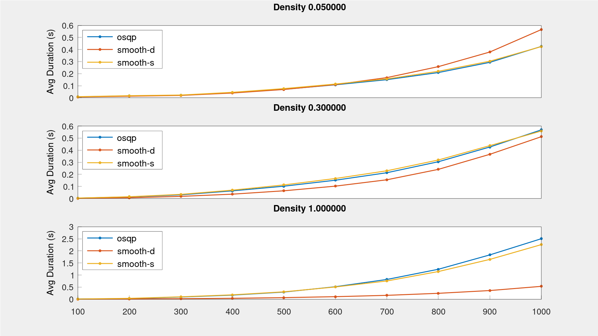

# smooth_feedback: Control and estimation on Lie groups

[![CI Build and Test][ci-shield]][ci-link]
[![Code coverage][cov-shield]][cov-link]
[![License][license-shield]][license-link]

* Requirements: C++20, Eigen 3.4, boost::numeric::odeint, LAPACK, [smooth][smooth-link]
* [Documentation][doc-link]

Tool collection for control and estimation on Lie groups leveraging the
[smooth][smooth-link] library.

## Control on Lie groups

These controllers are implemented for systems with dynamics on the form
,&space;\quad&space;\mathbf{x}&space;\in&space;\mathbb{X},&space;\mathbf{u}&space;\in&space;\mathbb{U}) where `X` is a `smooth::LieGroup` and `U` is a `smooth::Manifold`. 

Nonlinearities are handled via linearization around a reference point or trajectory.
For group-linear dynamics this automatically results in a linear system in the tangent space, 
in which case these algorithms are expected to work very well. Linearization is done via
[automatic differentiation][ad-link]. For this to work with the most performant methods (e.g. [autodiff][autodiff-link]) the functions must be templated on the scalar type. 
The dynamical system


on SE(2) x R3 and with two inputs can be defined via a lambda function in a way that supports automatic differentiation as follows:
```cpp
#include <Eigen/Core>

#include <smooth/bundle.hpp>
#include <smooth/se2.hpp>

#include <chrono>

// Time type
using Time = std::chrono::duration<double>;
// State space (must be a smooth::LieGroup)
template<typename T>
using X = smooth::Bundle<smooth::SE2<T>, Eigen::Matrix<T, 3, 1>>;
// Input space (must be a smooth::Manifold)
template<typename T>
using U = Eigen::Matrix<T, 2, 1>;

auto dyn = []<typename T>(Time, const X<T> & x, const U<T> & u) -> smooth::Tangent<X<T>> {
  return smooth::Tangent<X<T>>{
    x.template part<1>().x(),
    x.template part<1>().y(),
    x.template part<1>().z(),
    -T(0.2) * x.template part<1>().x() + u(0),
    T(0),
    -T(0.4) * x.template part<1>().z() + u(1),
  };
};
```


### PID Control: A classic, now on Lie groups

* Model-free
* Assumes that inputs control body acceleration. See `examples/pid_se2.cpp` for an example of allocating PID inputs to actuators.

**Example** PID controller on SE(2)

```cpp
#include <smooth/feedpack/pid.hpp>

smooth::feedback::PID<Time, smooth::SE2d> pid;

// set desired motion
pid.set_xdes([](Time Time) -> std::tuple<smooth::SE2d, Eigen::Vector3d, Eigen::Vector3d> {
  return {
    smooth::SE2d::Identity(),  // position
    Eigen::Vector3d::Zero(),   // velocity (right derivative of position w.r.t. t)
    Eigen::Vector3d::Zero(),   // acceleration (second right derivative of position w.r.t. t)
  };
});

Time t            = Time(1);                    // current time
smooth::SE2d x    = smooth::SE2d::Random();     // current state
Eigen::Vector3d v = Eigen::Vector3d::Random();  // current body velocity

Eigen::Vector3d u = pid(t, x, v);
```

### Model-Predictive Control: When more look-ahead is needed

* Automatic linearization and time discretization of nonlinear continuous dynamics
* Define state and input reference trajectories via arbitrary functions `T -> X` and `T -> U` for a time type T

**Example**: Model-predictive control on `dyn` defined above (see also `examples/mpc_asif_se2.cpp`)

```cpp
#include <smooth/feedback/mpc.hpp>

smooth::feedback::MPC<Time, X<double>, U<double>, decltype(dyn)> mpc(dyn, {.T = 5, .K = 50});

// set desired input and state trajectories
mpc.set_udes([]<typename T>(T t) -> U<T> { return U<T>::Zero(); });
mpc.set_xdes([]<typename T>(T t) -> X<T> { return X<T>::Identity(); });

Time t(0);
X<double> x = X<double>::Identity();

// get control input for time t and state x
auto [u, code] = mpc(t, x);
```

### Active Set Invariance

* Automatic differentiation of nonlinear continuous dynamics and constraints
* Minimally invasive filtering of a control input in order to enforce state constraints
* Theory (non-Lie group case) is described in e.g. [Thomas Gurriet's Ph.D. thesis](https://thesis.library.caltech.edu/13771/1/My_Thesis.pdf)

**Example**: Safety filtering on `dyn` defined above.

```cpp
#include <smooth/feedback/asif.hpp>

smooth::feedback::ASIFilter<Time, X<double>, U<double>, decltype(dyn)> asif(dyn);

// safety set S(t) = { x : h(t, x) >= 0 }
auto h = []<typename T>(T, const X<T> & x) -> Eigen::Matrix<T, 1, 1> {
  return Eigen::Matrix<T, 1, 1>(x.template part<0>().r2().x() - T(0.2));
};

// backup controller
auto bu = []<typename T>(T, const X<T> &) -> U<T> { return U<T>(1, 1); };

Time t          = Time(1);
X<double> x     = X<double>::Random();
U<double> u_des = U<double>::Zero();

// get control input for time t, state x, and reference input u_des
auto [u_asif, code] = asif(t, x, u_des, h, bu);
```


## Estimation on Lie groups

Estimators take system models on the form
,&space;\quad&space;\mathbf{x}&space;\in&space;\mathbb{X}) where `X` is a `smooth::LieGroup`, and measurements on the form &space;\oplus_r&space;w,&space;\;&space;w&space;\in&space;\mathcal&space;N(0,&space;R)).


To use in a feedback loop for a controlled system use partial application:
```cpp
// variable that holds current input
U<double> u = U<double>::Random();
// closed-loop dynamics
auto dyn_cl = [&u]<typename T>(T t, const X<T> & x) { return dyn(Time(t), x, u.template cast<T>()); };
```

### smooth::feedback::EKF: The only Kalman filter you need in 63 lines of code

* Templated over dynamics and measurement models
* Automatic differentiation
* Reduces to [standard Kalman filter (KF)](https://en.wikipedia.org/wiki/Kalman_filter) for linear models on Rn
* Reduces to [Invariant Extended Kalman Filter (IEKF)](https://en.wikipedia.org/wiki/Invariant_extended_Kalman_filter) for group-linear models on Lie groups 

**Example: localization with a known 2D landmark** with the system `dyn` defined above

```cpp
#include <smooth/feedback/ekf.hpp>

// measurement model
Eigen::Vector2d landmark(1, 1);
auto h = [&landmark]<typename T>(const X<T> & x) -> Eigen::Matrix<T, 2, 1> {
  return x.template part<0>().inverse() * landmark;
};

// PREDICT STEP: propagate filter over time
ekf.predict(dyn_cl,
  Eigen::Matrix<double, 6, 6>::Identity(),  // motion covariance Q
  1.                                        // time step length
);

// UPDATE STEP: register a measurement of the known landmark
ekf.update(h,
  Eigen::Vector2d(0.3, 0.6),   // measurement result y
  Eigen::Matrix2d::Identity()  // measurement covariance R
);

// access estimate
auto x_hat = ekf.estimate();
auto P_hat = ekf.covariance();
```


## Optimization

To make it easy to solve the quadratic programs generated by the MPC and ASIF functions
a QP solver is included.

### smooth::feedback::solve_qp: Fast QP Solver in pure Eigen

* Eigen port of the [operator splitting QP solver](https://osqp.org/). 
* For both dense and sparse problems.
* Eigen lazy evaluations enable fast SIMD in the compiled assembly.

Preliminary results suggest that the performance compares favorably to the original OSQP implementation.
The plot below compares solution times (lower is better) for square QPs over three different levels of sparsity. Although the `smooth` sparse (smooth-s) solver is consistently faster than the `smooth` dense (smooth-d) and osqp solvers, it currently appears to be slightly less robust than the other methods on ill-conditioned problems. 



The results are generated from the benchmarking program in `benchmark/`. 

**Example**: Define and solve a dynamically sized dense quadratic program.

```cpp
#include <smooth/feedback/qp.hpp>

// define the QP
//  min 0.5 x' * P * x + q' * x
//  s.t l <= A * x <= u
smooth::feedback::QuadraticProgram<-1, -1> qp{
  .P = P,  // n x n matrix
  .q = q,  // n x 1 vector
  .A = A,  // m x n matrix
  .l = l,  // m x 1 vector
  .u = u,  // m x 1 vector
};

smooth::feedback::QPSolverParams prm{};
auto sol = smooth::feedback::solve_qp(qp, prm);
```

<!-- MARKDOWN LINKS AND IMAGES -->
[doc-link]: https://pettni.github.io/smooth_feedback

[ci-shield]: https://img.shields.io/github/workflow/status/pettni/smooth_feedback/build_and_test/master?style=flat-square
[ci-link]: https://github.com/pettni/lie/actions/workflows/build_and_test.yml

[cov-shield]: https://img.shields.io/codecov/c/gh/pettni/smooth_feedback/master?style=flat-square
[cov-link]: https://codecov.io/gh/pettni/smooth_feedback

[license-shield]: https://img.shields.io/github/license/pettni/smooth_feedback.svg?style=flat-square
[license-link]: https://github.com/pettni/smooth_feedback/blob/master/LICENSE

[autodiff-link]: https://github.com/autodiff/autodiff/
[smooth-link]: https://github.com/pettni/smooth/
[ad-link]: https://en.wikipedia.org/wiki/Automatic_differentiation

